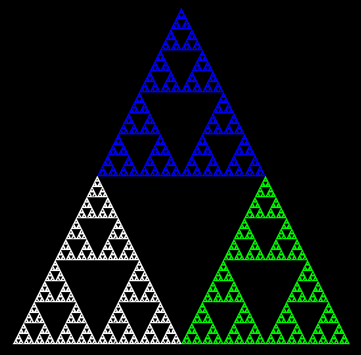
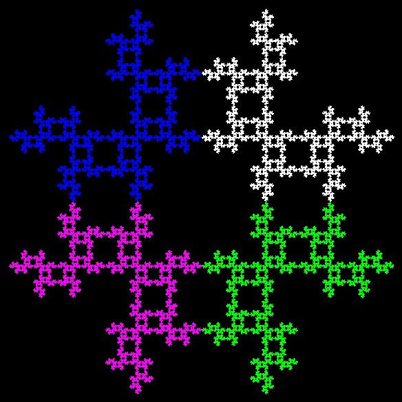
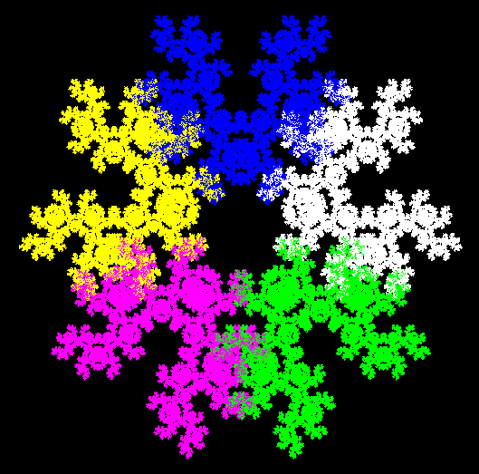
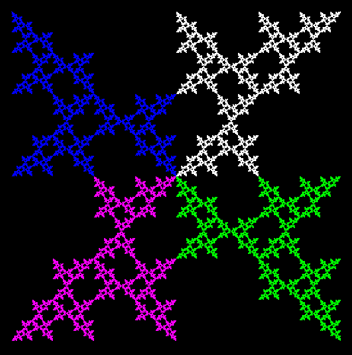
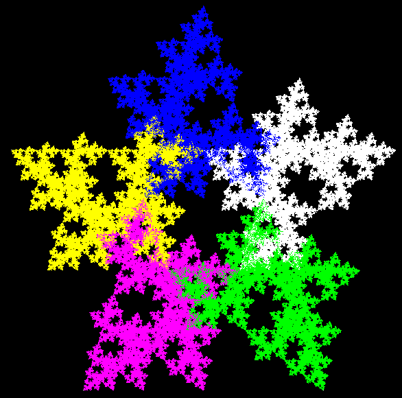
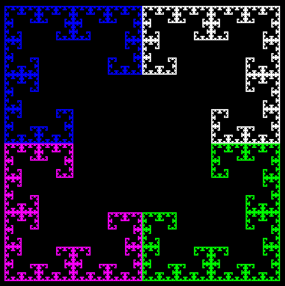
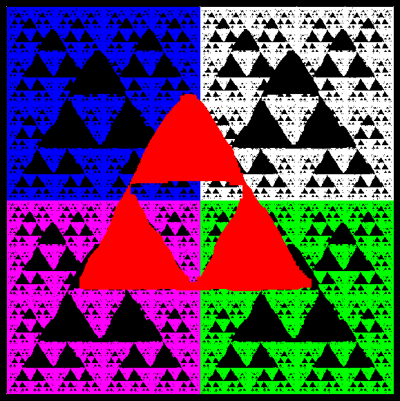

# chaos game

This is an implementation of the chaos game, it is a method to create fractals.

The rules are simple, a shape composed of numerous vertices is selected.
A point is chosen among the vertices of the shape.
At each iteration a vertex is selected and the point becomes the middle of the line between the point and the vertex, the process repeats itself until the maximum number of drawn points is reached.

Several restrictions can be applied to the game.

Obtained result using a triangle and no restrictions:

Not selecting the same vertex twice in a row using, a square:

Not selecting the same vertex twice in a row using, a pentagon:

Anti-clockwise, current vertex cannot be one place away from the previous one, using a square:

Anti-clockwise, current vertex cannot be one place away from the previous one, using a pentagon:

The current vertex cannot be two place away from the previous one in either directions, using a rectangle:

When we prevent the point from landing on a particular region of the square, the shape will be reproduced as a fractal in other places of the square.
Obtained result in a square with the restricted zone appearing in red.

